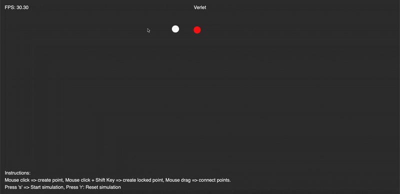

# Verlet

Verlet Integration simulation with P5.js

## Instructions

- Mouse click => create point
- Mouse click + Shift Key => create locked point
- Mouse drag => connect points
- Press 's' => Start simulation
- Press 'r': Reset simulation

## Demo

A demo is available at: [https://lucaangioloni.github.io/verlet/](https://lucaangioloni.github.io/verlet/)

